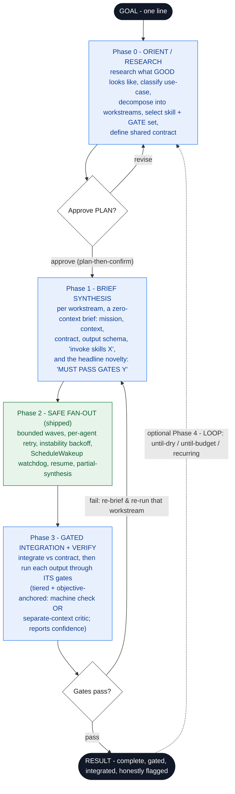

# Design — Agentic-Swarm Architecture Harness (umbrella, toward v1.0)

**Status:** architecture **CONVERGED** (2026-06-27) — lifecycle diagram in §2; **build deferred**.
**Supersedes scope of:** the standalone v0.5.0 robustness eval (now folded in as the *safety-proof*
component). **Research backing:**
[`research/2026-06-27-architecture-research-synthesis.md`](research/2026-06-27-architecture-research-synthesis.md)
— a dogfooded research swarm (`wf_ee0c68b9-95c`, 8/8 subareas: LangGraph · CrewAI · AutoGen · OpenAI
Agents SDK · Anthropic multi-agent · plan-execute-verify · context-engineering · quality-gates).

## 1. Vision

Turn a **one-line goal** into **excellent, complete, end-to-end output** by composing three layers:

| Layer | What it guarantees | Status |
| --- | --- | --- |
| **SAFETY** | a large fan-out *survives* — bounded waves, retry, watchdog, resume, partial-synthesis; never silently stalls or loses coverage | **shipped** (`/agentic-swarm`, v0.1–0.4) |
| **QUALITY** *(new)* | the fan-out *produces better work than one agent could* — research-driven decomposition, skill+gate-aware subagent briefs, gated integration | **this design** |
| **PERSISTENCE** | work spans turns/sessions — loop-until-dry / loop-until-budget / recurring | **shipped** (`/loop` support, v0.4) |

Positioning shifts from *"safe by construction"* to **"safe *and excellent* by construction."**

**Why now:** the loop game demo proved a bare swarm is *not* automatically better than one agent —
the subagents were generic workers. The missing ingredient is exactly this QUALITY layer: research +
skill-equipped, gate-checked briefs. That is what makes "parallel workers" into "a better result."

## 2. The harness lifecycle

```
GOAL (one line)
  │
  ▼ PHASE 0 — ORIENT / RESEARCH  (the orchestrator, before any fan-out)
  │   • research the domain: "what does GOOD look like here?", constraints, prior art
  │   • classify the use-case (web UI · game · CLI · API · data/ML · library · docs · audit · research)
  │   • DECOMPOSE into workstreams (the work-list)
  │   • SELECT the skill-set + GATE-set per workstream (use-case → gates)
  │   • define the shared CONTRACT (interfaces, design tokens, conventions) so outputs integrate
  │   ⇒ output: a PLAN  (workstreams × skills × gates × contract)   ← user checkpoint (approve plan)
  │
  ▼ PHASE 1 — BRIEF SYNTHESIS   (/agent-prompt, bundled into the plugin)
  │   • for each workstream, synthesize a rich ZERO-CONTEXT subagent brief:
  │     mission · research context · contract/interfaces · expected output schema ·
  │     "invoke skills [...]" · "you MUST pass gates [...]" · lean-output + integration rules
  │
  ▼ PHASE 2 — SAFE FAN-OUT      (existing rails — the proven safety layer)
  │   • run briefed subagents in bounded waves + per-agent retry + instability backoff;
  │     arm the ScheduleWakeup watchdog; resume on stall. (This is the v0.5.0 robustness proof.)
  │
  ▼ PHASE 3 — GATED INTEGRATION + VERIFY
  │   • integrate outputs against the contract
  │   • run each output through ITS gates = skill-backed adversarial verification
  │     (the existing verify / judge-panel / completeness-critic patterns, NAMED + SELECTED)
  │   • iterate failures until they pass or are explicitly flagged
  │
  ▼ PHASE 4 — (optional) LOOP    (v0.4 persistence)
  │   • across sessions: loop-until-dry / loop-until-budget / recurring, resuming the PLAN
  ▼
RESULT  (complete · gated · integrated · honestly flagged where thin)
```

### Converged lifecycle (Mermaid · research-validated 2026-06-27)

The simplified flow below is the **converged** representation of the lifecycle above. Color encodes
the three layers — **blue = QUALITY (new)**, **green = SAFETY (shipped)** — and the dashed back-edge
is **PERSISTENCE (`/loop`, shipped)**. The headline novelty (*forward-coupling the named gate into
the brief*) lives in Phase 1. Editable source: [`diagrams/harness-lifecycle.mmd`](diagrams/harness-lifecycle.mmd).



## 3. Components — where each lives in the plugin

| Component | New? | Home |
| --- | --- | --- |
| Safe fan-out rails (8 patterns, template, watchdog, resume) | exists | `skills/agentic-swarm/` |
| `/loop` pairing (3 loop layers, loop-until-dry/budget) | exists (v0.4) | `skills/agentic-swarm/reference/loops.md` |
| **Architect orchestration** (Phases 0,1,3) | **new** | a new skill, e.g. `skills/architect/` (`/agentic-swarm:architect`) |
| **Brief synthesizer** (`/agent-prompt`-style, Phase 1) | **new** | `reference/brief-template.md` + synthesis guidance in the architect skill |
| **Gate library** (Phase 3) | **new** | `skills/architect/gates/` (one file per gate) + a use-case→gate map |
| Robustness eval (safety proof) | in progress | `evals/loop-demo/code-review/` (fold in) |
| Game-demo redo (quality showcase) | future | `evals/loop-demo/game/` |

## 4. The GATE model (the crux)

A **gate** = a named, reusable quality checkpoint a workstream's output must pass before acceptance.

```
gate := {
  id            // 'ui-ux' | 'assets' | 'a11y' | 'tests' | 'security' | 'perf' | 'docs' | 'api-contract'
  applies_when  // use-case / output triggers (e.g. ui-ux applies when the output renders UI)
  tier          // 'objective' (test/build/lint/measurable) | 'critic' (separate-context judge) | 'advisory'
  criteria      // CONCRETE, self-contained pass conditions (shipped IN the plugin)
  verifier      // an adversarial-verify subagent prompt that checks criteria, in a SEPARATE context
  confidence    // the gate REPORTS how trustworthy its verdict is — never a silent pass
  backing_skill // OPTIONAL external skill that strengthens the gate IF installed
}
```

**Tiered, objective-anchored gates (converged 2026-06-27 — the answer to "gate theater").** LLM
judges are biased (verbosity, position, self-enhancement) and have low test-retest reliability, so a
gate that holistically "scores" output is theater. Every gate therefore declares a **`tier`** and
**reports `confidence`**, never a silent pass:
- **`objective`** — a machine-checkable criterion (run tests, build/lint, assert assets exist, WCAG
  contrast math). Preferred wherever the use-case allows; highest trust.
- **`critic`** — a **separate-context** adversarial verifier (cross-context review beats same-thread
  self-review), using **binary per-criterion checks** (not a holistic 1–10), **one well-grounded
  pass** (more rounds add noise), and pairwise/position-swap where scoring is unavoidable.
- **`advisory`** — a judgment the harness surfaces but does **not** treat as a hard pass.

This keeps the repo's **"measured, not asserted"** ethos: graceful degradation (a missing backing
skill) must **never become *silent* quality degradation** — the gate reports it in `confidence`.

**⚠ Portability constraint (load-bearing).** The plugin is **public**; other users will **not** have
the skills this machine has (`frontend-design`, `ui-ux-pro-max`, `web-design-guidelines`,
`responsive-ui-audit`, the WCAG skill, etc. are *separate* plugins). So:
- Every gate ships **self-contained criteria + verifier** that work with **zero external skills**.
- External skills are **opportunistic enhancers**: the orchestrator detects which are available and
  wires them in *if present* ("invoke `frontend-design` if available; else use the bundled criteria").
- The harness must **degrade gracefully** — never hard-fail because a gate's backing skill is absent.

**v1 gate library (proposed):** `ui-ux`, `assets` (real SVG/icons, no placeholders), `a11y`,
`tests`, `security`, `api-contract`, `docs`. Each backed by bundled criteria; external-skill hooks noted.

**Use-case → gate mapping (default, orchestrator may extend from research):**

| Use-case | Default gates |
| --- | --- |
| Web UI / game / frontend | ui-ux, assets, a11y, tests |
| API / backend / library | api-contract, tests, security, docs |
| Data / ML pipeline | tests, contract, docs |
| Audit / research swarm | completeness, source-verification (these are the eval's existing patterns) |

## 5. Folding in the existing work

- **v0.5.0 robustness eval** → becomes the **Phase 2 SAFETY proof** of the harness: the deterministic
  curve + the real axios review + the real session-drop evidence already show "safe fan-out preserves
  coverage / fails loudly." It is no longer a standalone release; it is *the evidence that Phase 2
  works.* (Artifacts already committed on `feat/loop-demo-v0.5.0`.)
- **Loop game demo** → becomes the **whole-harness QUALITY showcase**: re-run "build a Three.js game"
  *through the architect harness* (research → UI/UX + art + gameplay + audio workstreams → gated
  briefs → safe fan-out → gated integration). Expect the swarm arm to now decisively beat a bare
  `/loop`, with the two earlier games kept as the honest "before" baseline.

**Showcase roadmap** (decided): the **game redo is FIRST** (closes the loop, exercises the ui-ux +
assets gates hardest, most visually compelling). **Later**, run the harness on **broadly-useful apps
most people actually build** — a **landing page**, a **dashboard**, a small **CLI** — to prove it
generalizes beyond games and hits the "useful to most people" bar. These exercise different gate sets
(landing page → ui-ux + assets + a11y + perf; dashboard → ui-ux + data-viz + a11y + tests), so they
also *broaden the gate library* as we go. Each is its own showcase artifact under `evals/`.

## 6. MVP scope (proposed for the first harness release)

Smallest thing that proves the whole loop end-to-end:
1. The **architect skill** (Phases 0,1,3) — research → plan → briefs → gated integration guidance.
2. The **brief template** + synthesis guidance (Phase 1).
3. A **starter gate library**: `ui-ux`, `assets`, `tests` (self-contained; external-skill hooks).
4. The **game-demo redo** as the proof it produces better end-to-end work.
5. The **robustness eval** folded in as the safety proof.
6. Tests + `claude plugin validate --strict` green; privacy unchanged; docs/README updated.

## 7. Decisions

**Settled (2026-06-27):**
1. **Skill packaging:** a *new* skill `/agentic-swarm:architect` layered over `/agentic-swarm` (keeps
   the safe-rails skill focused). ✅
2. **Portability stance:** gates ship **fully self-contained**; external skills are **optional
   enhancers** only (the plugin must work for users who don't have `frontend-design` etc.). ✅
3. **Autonomy model:** **plan-then-confirm** — the orchestrator presents the PLAN + gate-set for
   approval before the expensive fan-out (safety ethos + cost control). ✅
5. **Showcase:** **Three.js game redo FIRST**; broadly-useful apps (landing page, dashboard, CLI)
   **later** to prove generalization (see Showcase roadmap, §5). ✅
7. **Core architecture (research-validated):** ship **Arch 1** — orchestrator-worker with
   research-driven, **skill+gate-aware briefs** + **gated integration** — on a **plan-execute-verify**
   fan-out skeleton, borrowing LangGraph's persistence model *only as the reference* for
   `/loop`+resume. Reject the conversational (AutoGen) and handoff (OpenAI SDK) shapes, and reject
   adopting LangGraph/CrewAI as the runtime (libraries, not portable plugins). ✅
8. **Headline novelty:** ***forward-coupling the named gate into the brief*** — across all 8 surveyed
   areas, gates are applied *after* production and briefs are authored *independently* of any rubric;
   **no surveyed system feeds the gate definition forward into the brief.** Plus **skill-aware
   briefing** and **zero-dependency portable-plugin packaging**. *Honest caveat:* this is
   *integration + packaging*, not a new algorithm, and is **unproven until the showcase measures it.* ✅
9. **Gate reliability stance:** **tiered, objective-anchored gates that report `confidence`** (see §4)
   — the answer to "gate theater" (biased, low-test-retest LLM judges). ✅

**Resolved (2026-06-27 — research-backed; see [`2026-06-27-mvp-gate-library-and-versioning-plan.md`](2026-06-27-mvp-gate-library-and-versioning-plan.md)):**
4. **MVP gate set:** **`{ tests, assets, ui-ux }`** — `tests`=objective, `assets`=mixed, `ui-ux`=mixed
   (objective floor + screenshot critic) with the cheap a11y checks **folded into `ui-ux`**; standalone
   `a11y` **deferred to v0.7.x**. Each gate declares `tier` and reports `confidence`. ✅
6. **Versioning:** a **v0.5 → v1.0 track** — **`v0.5.0` now** (robustness eval = its own tag, the Phase-2
   safety proof) → v0.6 architect → v0.7 gates → v0.8 measured showcase → **v1.0** (only after the
   showcase measures the uplift; freezes the gate-file schema). ✅

No open architecture decisions remain; the next step is **build** (deferred), starting with the v0.5.0
release chore — see the readiness build-spec §5.

## 8. Risks / constraints

- **Portability** (above) — the #1 design risk; gates must not assume installed skills.
- **Cost** — research + briefs + fan-out + gated verify is many agents; plan-then-confirm + budget
  controls (the `/loop` loop-until-budget pattern) bound it.
- **Scope creep** — keep the MVP tight; ship the loop end-to-end before broadening the gate library.
- **Honesty** — the harness's output claims must stay measured (gates produce *evidence* of quality,
  not just assertions), consistent with the repo's eval ethos.
- Existing invariants unchanged: skills frontmatter = name+description only; zero-dep; privacy;
  `claude plugin validate --strict` (both modes); no secrets.
